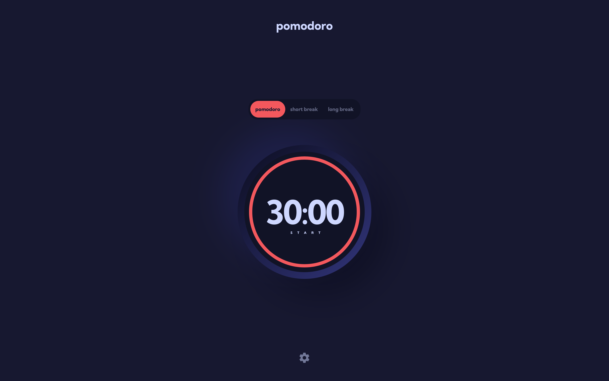
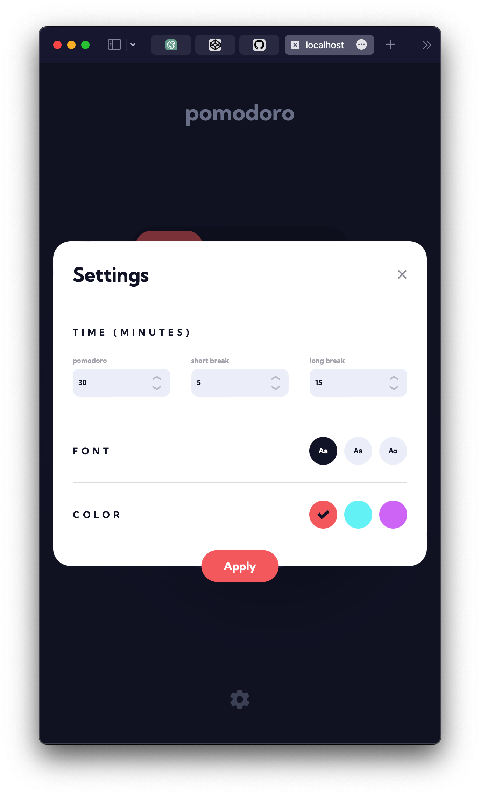

# Frontend Mentor - Pomodoro app solution

This is a solution to the [Pomodoro app challenge on Frontend Mentor](https://www.frontendmentor.io/challenges/pomodoro-app-KBFnycJ6G). Frontend Mentor challenges help you improve your coding skills by building realistic projects.

## Table of contents

- [Overview](#overview)
  - [The challenge](#the-challenge)
  - [Screenshot](#screenshot)
  - [Links](#links)
- [My process](#my-process)
  - [Built with](#built-with)
  - [What I learned](#what-i-learned)
  - [Continued development](#continued-development)
  - [Useful resources](#useful-resources)
- [Author](#author)

## Overview

### The challenge

Users should be able to:

- Set a pomodoro timer and short & long break timers
- Customize how long each timer runs for
- See a circular progress bar that updates every minute and represents how far through their timer they are
- Customize the appearance of the app with the ability to set preferences for colors and fonts

### Screenshot

### Links

- Solution URL: [GitHub](https://github.com/martinideniam/pomodoro-app)
- Live Site URL: [Netlify](https://legendary-lamington-4f172e.netlify.app)

## My process

### Built with

- Semantic HTML5 markup
- CSS custom properties
- Flexbox
- CSS Grid
- Mobile-first workflow
- [React](https://reactjs.org/) - JS library

### What I learned

I practiced concepts learned in module 11 of Scrimba "The Frontend Developer Career Path", such as useRef, useState, useEffect, props etc.

### Continued development

I want to add some animations in the near future, using GSAP.

### Useful resources

- [Module 11 of Scrimba](https://scrimba.com/learn/frontend) - This helped me to grasp the basics of React.

## Author

- Frontend Mentor - [@martinideniam](https://www.frontendmentor.io/profile/martinideniam)
- Twitter - [@vlad_webdev](https://twitter.com/vlad_webdev)
